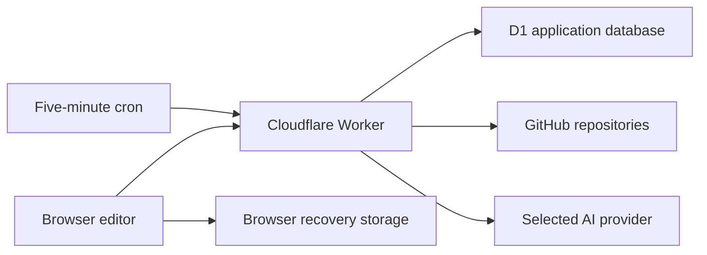

The active hosted web runtime is Cloudflare Workers with D1. It serves a Vite/React browser client and a tRPC API. GitHub stores repository content; D1 stores application state. The laptop is not the production server.

## Request path

Static assets come from the configured asset binding. API requests go through `server/worker.ts`, which routes OAuth, authenticated repository previews, and tRPC calls. The tRPC context resolves the user, and protected procedures require authentication.

The public health endpoint returns an availability response. It is not a database integrity test, a full dependency probe, or proof of successful publishing.

## Data ownership boundaries

Browser recovery belongs to one browser profile. Forge drafts and settings belong to database records associated with users and sites. Published posts and uploaded assets are GitHub files. Deleting one kind of record does not necessarily remove the others.

## Background work

The scheduled Worker event processes due blog and social jobs, then removes expired rate-window and mobile-auth-code records. It does not depend on an open browser. External authorization and quotas still apply.

## Historical code

The repository retains historical Manus/Express utilities and old audit documents. The Worker entry point and current configuration determine the active path. Do not run an old setup recipe merely because its filename looks official.

## Source and verification

Source-reviewed against app revision `c889b55` on September 20, 2026. This label establishes implementation evidence, not live acceptance of every operation. See [Current state](/reference/current-state).

[server/worker.ts](https://github.com/CassieMarie0728/jekyll-forge/blob/c889b55402f374d832b2412d9ce1a32c5fae06a7/server/worker.ts), [server/routers.ts](https://github.com/CassieMarie0728/jekyll-forge/blob/c889b55402f374d832b2412d9ce1a32c5fae06a7/server/routers.ts), [server/_core/context.ts](https://github.com/CassieMarie0728/jekyll-forge/blob/c889b55402f374d832b2412d9ce1a32c5fae06a7/server/_core/context.ts), [wrangler.jsonc](https://github.com/CassieMarie0728/jekyll-forge/blob/c889b55402f374d832b2412d9ce1a32c5fae06a7/wrangler.jsonc).
